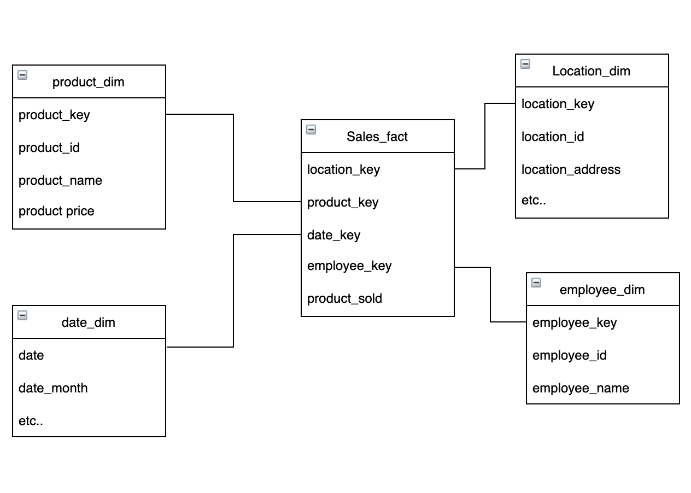
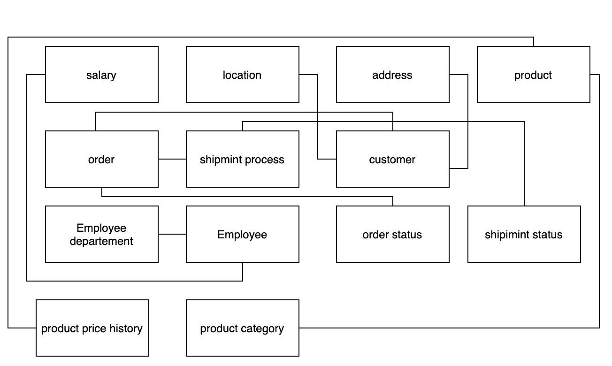

## What is dimensional modeling?

Kimball, a mastermind of this modeling, describes it as :

> "a logical design technique that seeks to present the data in a standard, intuitive framework that allows for high-performance access."

> "Every dimensional model is composed of one table with a multipart key, called the fact table."

So basically, the model contains a transactional table called a Fact table; around this table, there are multiple small tables which we call dimension tables(how sweet). These small tables contain a surrogate key generated by the data warehouse and a set of attributes that describe the record. 

## Principles of dimensionality :
- Measure/Event

For every modeling we do in the data warehouse, we need something to measure. This measure can be a calculation ex. average, sum etc .. or tracking a process which we call event

- Context

Context for the measurement meaning you have to describe what you are measuring.

### Fact Table 
We can describe the fact table with the following:
- It is a container of measurement.
- One record in a fact table is one event.
- All records should have the same grain in one table.
- Granularity means that if the fact table calculates total sales per month, all records should be calculated similarly.

### Dimension Table

- Who; who bought the product.
- When; when did the customer buy it.
- what; what is the product.
- where; where did the customer buy the product.

let us see an example :

Here we can see we have a four-dimensional table that describes our fact table. 

### ER modeling vs. DM 

Someone might ask, ok we have done our modeling what then? You can get this information from our transactional database. So yes we could probably do that but let me show the OLTP version of our database.

The domain-oriented consumer teams would be puzzling when he sees this, nor should he have to learn this. It is not his primary job. The data team should support him in making decisions, not burden him. that is why a lot of the tools who self-proclaimed to be state of the art; say you shouldn't model your data and make the data as-is (in 3NF); fail to understand this. 

When we design ER modeling, we need to normalize the design to be in 3NF preferably. It is data-oriented, not business-oriented. When the software engineer designs the schema, he wants fast writing, removing duplication, and avoiding reading huge tables.

On the other hand, dimensional modeling is business-oriented, meaning the event/business process is the unit design of the schema. It is embracing data redundancy and keeping historical data.

### How can I start Building A Data-Mart?
There is no clear path or way to build a data-mart until the business asks you about a set of KPIs they want to calculate. but they usually follow this path: 

1. Understand the business requirements.
2. Declare the granularity of the data mart
3. Identify the dimensions
4. Identify the fact
5. Design the dimensional model

#### Understand the business requirements

why are we building the datamart, understand the bussiness proccess and how we can measure there requirement. also we need to check the quality of the data and is the data available from the source.

#### Declare the granularity of the data mart

Let us see return to our example above. CEO of a retail shop asked you to build for him a report on how many employee sells a product. 
So the event is selling a product and whenever some salesperson sells something, our fact should capture this event, and this is our grain. one sales = one record.

#### Identify dimension 

Here we have to use the grain to identify the dimension to know the level of details of our dimension. in our previous example, we can see our dimensions are employee, product, and date to know when our product had been sold. 

#### Identify the fact
in this step you identify how to measure the KPI based on business requirement.

#### Design the dimensional model
now that you have Identify the dimensions and fact. now you need to get your hand on the nitty-gritty of code. and how to handle historical data(we will get on this on another blog). Develop strategies to handle aggregation, indexing, and partitioning of the data in your dimensional model.

## Conclusion
Data Architect/modeling is a vast area. And one of the areas that there is no right or wrong. Each modeler has a way of doing things. But dimensional modeling has been since the 90' and has weathered the storm of how each one of data warehouse should contain this way of modeling. And this article touches the tip of the iceberg in this field.

### References

[Kimball The Data Warehouse Toolkit 3rd-Edition
](https://aatinegar.com/wp-content/uploads/2016/05/Kimball_The-Data-Warehouse-Toolkit-3rd-Edition.pdf
)

[IBM Data Modeling](https://www.ibm.com/docs/en/ida/9.1.1?topic=modeling-data
)

